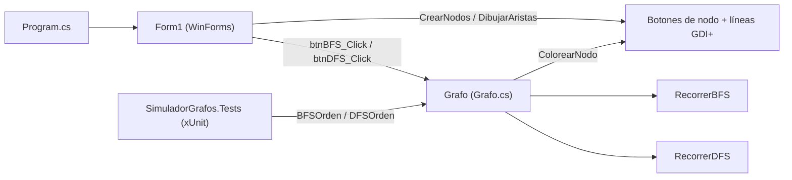

<div align="center">
  
  <h1>GrafoVisual</h1>
  <p><b>Visualizador de recorridos BFS y DFS sobre un grafo de 20 nodos, en C# y Windows Forms, para ver cómo se colorea cada paso.</b></p>
  
  
  
  
  
  <br/>
  <a href="https://github.com/Luiss2080/GrafoVisual/actions/workflows/build-and-test.yml"></a>
  <p>
    <a href="#-inicio-rápido">Inicio rápido</a> ·
    <a href="#-características">Características</a> ·
    <a href="#️-arquitectura">Arquitectura</a> ·
    <a href="#-pruebas">Pruebas</a> ·
    <a href="#-lo-que-todavía-no-existe">Limitaciones</a>
  </p>
</div>

---

GrafoVisual es una app de escritorio (solo Windows) que dibuja un grafo no dirigido **fijo de 20 nodos** y ejecuta sobre él **BFS** y **DFS iterativo** desde el nodo que elijas, coloreando los nodos a medida que se visitan y escribiendo la bitácora paso a paso. Es una herramienta didáctica: **no** es un editor de grafos ni implementa Dijkstra ni otros algoritmos con pesos.

## 🎬 Vista rápida

No se incluyen capturas: la interfaz calcula su diseño para la ventana maximizada y dibuja los nodos con formas personalizadas, y al renderizarla sin escritorio interactivo (`Control.DrawToBitmap`) el resultado salía deformado y recortado. Para no mostrar imágenes engañosas, este es el flujo real de uso:

```text
1. Abrir la app            -> ventana maximizada, árbol de 20 nodos (0 arriba, 15-19 abajo)
2. "Nodo inicial": [ 0 ]   -> control numérico de 0 a 19
3. [Ejecutar BFS] / [Ejecutar DFS]
     BFS: vecino descubierto -> amarillo   | nodo visitado -> verde claro
     DFS: vecino apilado     -> azul claro | nodo visitado -> rojo claro
     panel izquierdo       -> "Iniciando BFS desde el nodo 0 / Orden de visita: 0 1 2 ..."
                              "Paso 1: Visitando vecino 1 del nodo 0" ...
```

## ✨ Características

| Característica | Detalle |
|---|---|
| Grafo fijo de 20 nodos | Definido en `Form1.InicializarGrafo`; nodos como botones circulares y aristas dibujadas con `System.Drawing` (flechas en las conexiones padre-hijo). |
| BFS y DFS iterativo | Se ejecutan desde cualquier nodo (0-19) elegido con un control numérico; los botones de la UI llaman a `Grafo.BFS` y `Grafo.DFS`. |
| Animación y bitácora | Cada nodo cambia de color al descubrirse/visitarse (BFS: amarillo y verde claro; DFS: azul claro y rojo claro), con pausas fijas (300-500 ms) y un cuadro de texto con el orden de visita. |
| Núcleo separado de la UI | `Grafo.cs` expone `BFSOrden`, `DFSOrden` y `DFSOrdenRecursivo` sin efectos visuales (esta última solo se usa en pruebas, no desde la interfaz). |
| Entradas validadas | Nodo fuera de rango lanza `ArgumentOutOfRangeException`; aristas duplicadas y auto-bucles no corrompen la lista de adyacencia; grafo vacío devuelve un mensaje. |
| Aclaración sobre "camino más corto" | BFS minimiza **saltos**: las aristas no tienen peso. |

## 🏗️ Arquitectura



## 🚀 Inicio rápido

| Requisito | Versión |
|---|---|
| Windows | Necesario (WinForms) |
| .NET SDK | Probado con 10.0; el CI usa 8.0.x |
| .NET Framework | 4.7.2 (objetivo de la app) |

```bash
git clone https://github.com/Luiss2080/GrafoVisual.git
cd GrafoVisual
dotnet build SimuladorGrafos.sln
./SimuladorGrafos/bin/Debug/SimuladorGrafos.exe
```

También puedes abrir `SimuladorGrafos.sln` en Visual Studio y pulsar F5. Verificado: `dotnet build`/`dotnet test` funcionan; la ejecución interactiva de la ventana no se probó en esta revisión.

<details>
<summary>Estructura de carpetas</summary>

```text
SimuladorGrafos/          App WinForms (Form1, Grafo, Program)
SimuladorGrafos.Tests/    Pruebas xUnit del núcleo (GrafoTests.cs)
.github/workflows/        build-and-test.yml (runner windows-latest)
SimuladorGrafos.sln
```

</details>

## 🧪 Pruebas

```bash
dotnet test SimuladorGrafos.Tests/SimuladorGrafos.Tests.csproj
```

**21 pruebas xUnit, todas pasan** (ejecutadas localmente). Cubren el núcleo `Grafo`, sin abrir formularios: grafos conectados y desconectados, ciclos, auto-bucles, aristas duplicadas, nodo inicial inválido, grafo vacío y un solo nodo. La interfaz gráfica no tiene pruebas.

## 🚧 Lo que todavía no existe

- No se pueden agregar, quitar ni editar nodos o aristas desde la interfaz: el grafo está fijo en el código.
- No hay Dijkstra, pesos en aristas, detección de ciclos ni análisis de conectividad.
- La animación usa `Thread.Sleep` y `Application.DoEvents`, así que la ventana no responde mientras corre un recorrido.
- El diseño está pensado para pantalla maximizada; no hay diseño adaptable.
- Sin capturas de pantalla ni paquete distribuible (hay que compilar).

## 📄 Licencia

MIT. Ver [`LICENSE`](LICENSE).

<div align="center"><sub>Hecho por Luiss2080 · BFS y DFS, paso a paso</sub></div>
